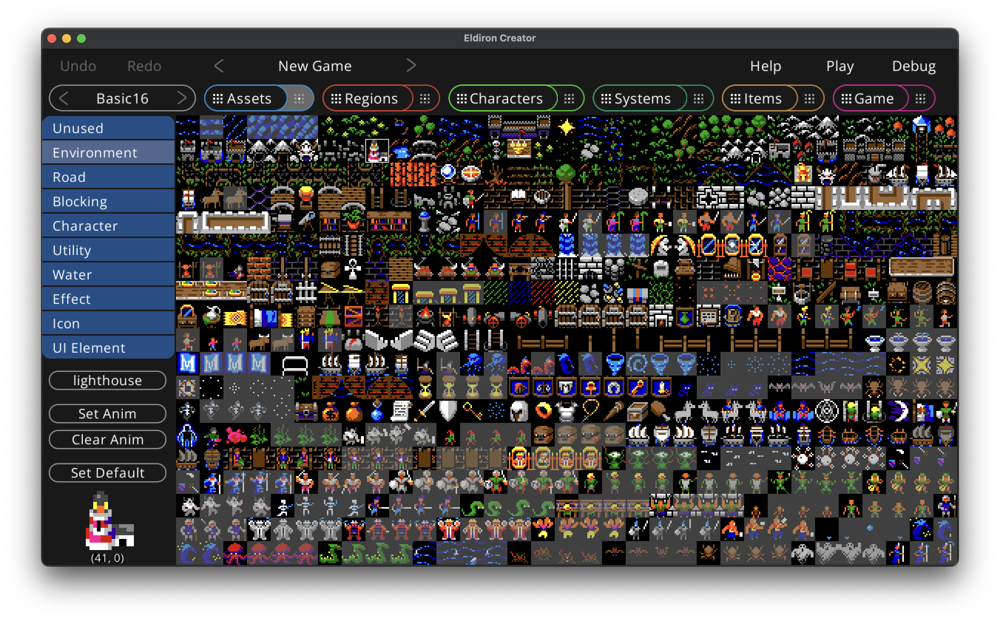

# Assets View: Overview

In the assets overview you can add assets to your game project.

  

The assets overview displays a node for each asset present in the [assets](/projects/assets.md) directory.

Assets currently are:

* **Tile-maps**. The icon displayed for the node is the tile set as default tile in the details view. You can set the *grid size* of the tile-map (the size of the square tiles in the tile-map) by clicking on the *Grid Size* property of the node.

* **Audio** files.

# Details: Tile-maps

  

The tile-maps details view lets you assign meta-data for each tile in the tile-map. This is an important step as Eldiron needs to know how each tile is supposed to be used in-game.

You can click on a tile to select it (or multi-select tiles by clicking and dragging the mouse over a range of tiles).

The most important step is to give each tile a usage role, this can be one of:

* **Unused** - This tile is ignored and will not be shown in the region editor.
* **Environment** - This is the default tile type for any kind of non blocking terrain. Use it for grass, floors etc.
* **Road** - Same as *Environment* but the AI in the *Pathfinder* node will prefer road tiles over environment tiles.
* **Blocking** - Every *Environment* tile which is not accessible to the player, like rocks, mountains, walls etc.
* **Character** - Character tiles, like animation tiles for a warrior.
* **Utility** - Utility character tiles. Like a ship or a horse.
* **Water** - Water tiles. Tiles where a ship can go.
* **Effect** - Effect tiles, like an explosion.
* **Icon** - In game icons (Swords, armor etc.).
* **UI Element** - UI Elements for screens and widgets.

 When you click the **Enter Tags** button you can assign a ',' separated *tags* to a tile, like *cupboard* or *waterfall*. Tags are always lower case. Tags can be used to quickly find tiles or to auto-convert regions to different tile-maps (not yet implemented).

 By clicking the **Set Anim** button you create an animation for the first tile in the selected range. The other tiles will be set to *Unused* by default.

The **Clear Anim** button will remove an animation sequence form the currently selected tile.

The **Set Default** button will set the currently selected tile as the default tile of the tile-map, it will be shown as the tile-map icon in the overview.
