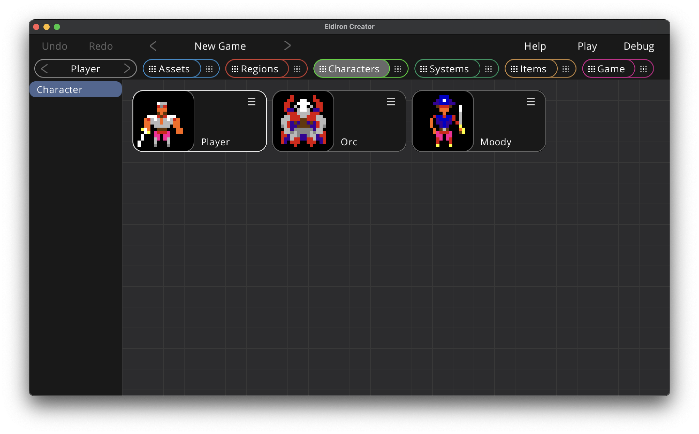

# Characters View: Overview

The characters view allows you to define characters, or character templates for non-player-characters. It utilizes [nodegraphs](./nodegraph.md) and [behavior trees](./nodegraph_behavior_trees.md) to implement character AI. Please read these chapters first.

A special case is the *Player* character which does not implement AI but defines how input commands are mapped into behavior actions. The player character is always the first character in the overview and cannot be deleted.

To create a new character drag and drop the character item from the left sidebar into the overview. You can rename and delete characters via the nodes context menu. Click on the node thumbnail to open the characters detail view.

# Characters View: Detail View

