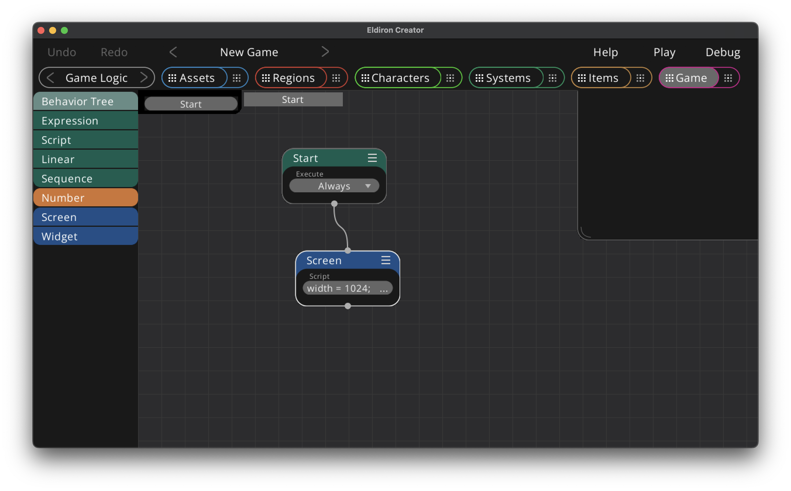

# Game View

The game view graph handles the overall game logic, which, in an RPG, basically means what is the visible content of the game right now.

The game [nodegraph](./nodegraph.md) works the same as other graphs by utilizing [behavior trees](./nodegraph_behavior_trees.md).

The visible content of the game is handled by screen nodes and their scripts.

The game view works differently than the other views in that it does not have a detail view, as there is only one game graph. Instead the detail button will show the [game settings](./game_settings.md) which define global game properties.

Screen nodes and their screen scripts play an important role as they draw the content of your game as well as define user interaction. You can read more about screen scripts in the reference [here](./ref_screen_scripts.md).