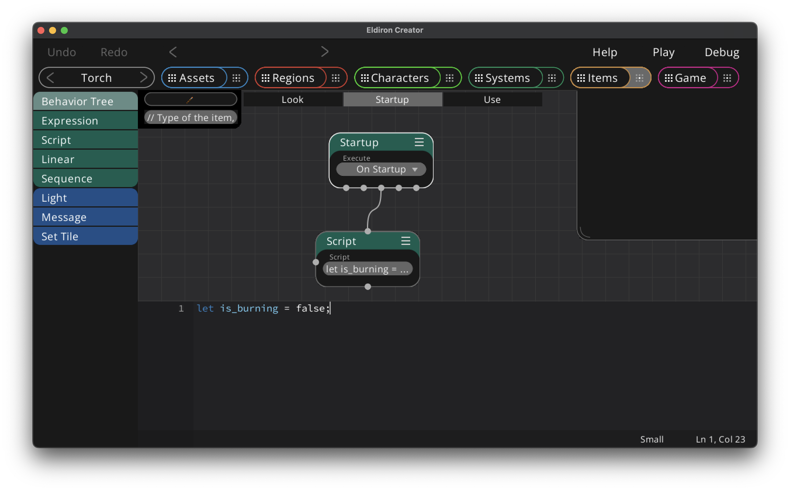

# Item State

If you set the item state to true in the [item setting](./item_settings.md) you can use scripts and expressions in your items as they have their own variable scopes.

In the above screenshot we have a Startup behavior tree which sets a "is_burning" boolean variable. This is the state of the torch, and we can use this state in the *"Look"* tree to send the appropriate message back to the user ("You see a torch. Use it to ignite it." or "You see a burning torch."). In the same way you can switch the state in the *"Use"* tree and adjust the tile for the item and it's light source settings.

