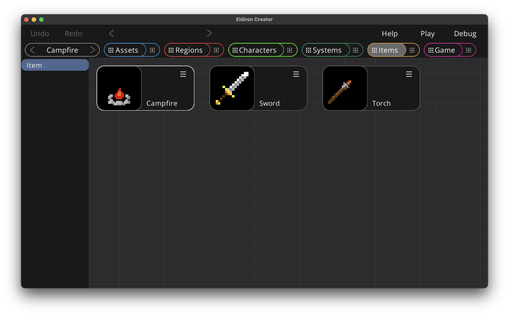
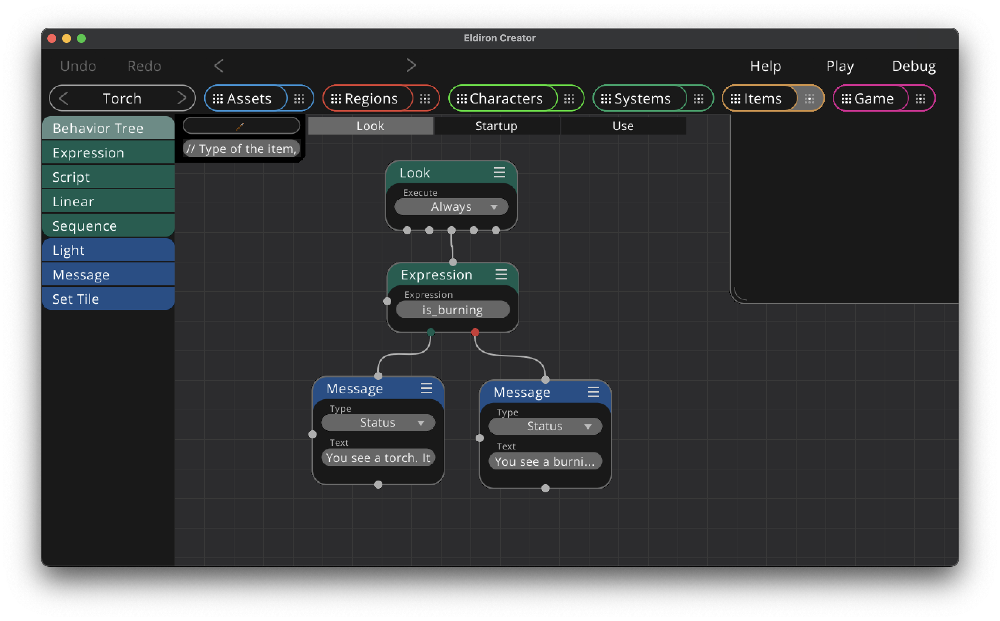

# Items View: Overview

The items view allows you to create in-game items. Just drag and drop the *Item* from the list into the graph to create a new in-game item.

As always, click on the preview area to open the detail view.

# Items View: Details

The item details view adds behavior to your items utilizing [nodegraphs](./nodegraph.md) and [behavior trees](./nodegraph_behavior_trees.md).

When a character performs an action on an item or a direction, let's say a *"Look"* action, the behavior tree of the same name in the item is executed. You can use this to send messages back to the user ("You see a burning torch"), ignite your torch using the *Light* node and execute more complex scripts if your item has [state](./item_state.md).

In the top left corner you have a permanent node which displays basic settings for the item: The default tile of the item and the [item settings](./item_settings.md).