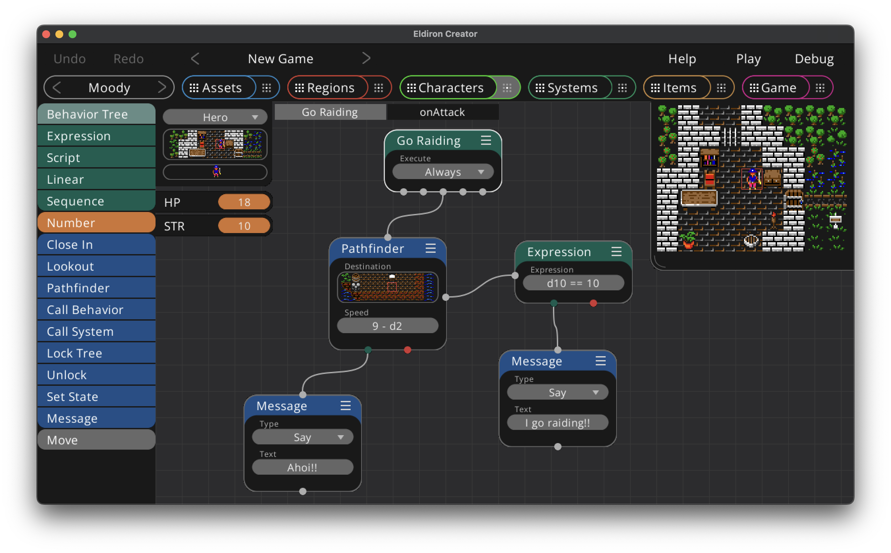

# Node Graphs & Scripting in Eldiron



Node graphs in Eldiron are a mix between nodes and scripting and try to combine the best of both worlds. The overall flow of execution is defined via nodes, while parameters of nodes are expressions or scripts which can be as complex as needed.

This has the advantage that you can easily visualize the overall flow of execution in a graph while adding details to behavior via node parameters which do not clutter up the node graph.

For example in the above screenshot the *Go Raiding* behavior tree executes the *Pathfinding* node which guides the character to a certain position or area in a region.

While the pathfinding is ongoing, i.e. the character did not reach its destination yet, the node connected to the terminal on the right side of the pathfinder node is executed. If the character successfully reached its destination the green OK terminal at the bottom of the pathfinding node is executed, if an error occured, for example the way to the destination is blocked for a longer period of time, the red ERROR terminal at the bottom of the pathfinding node is executed.

The *Speed* property of the pathfinding node is a number expression between 1 (the slowest) and 10 (the fastest, which is one movement per game tick).

You could just set the expression to
```rust
8
```
as the speed.

Or as we do in the above screenshot you could set to
```rust
9 - d2
```
which is 9 minus a dice throw of 2 (a random number of one or two) which gives a bit of a random speed, as this expression is evaluated for every movement the speed varies while the character is walking from tile to tile.

Or if things get more complex you could check if the character is on horseback or not or which usage role the current tile the characer is standing on has (for making the character walk slower in forests or hills).