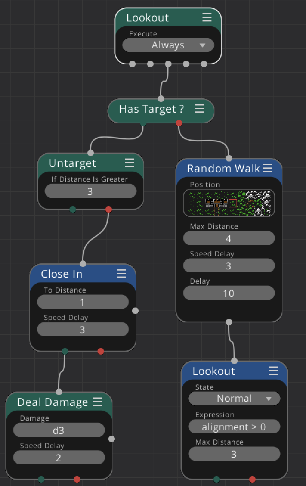

# Lookout / Random Walk / Deal Damage



This example is for a monster which random walks the area and attacks a hero (if it finds one).

First, it checks [if it has a target](../../nodes/has_target.md) already.

*If not*
* Perform a [Random Walk](../../nodes/random_walk.md).
* [Lookout](../../nodes/lookout.md) for a hero (alignment > 0) to attack. In this example we do not use the return value as we check again if we have a target in the next game tick. Remember that the Lookout node automatically sets the target if it finds a fitting character.

*If yes*
* [Untarget](../../nodes/untarget.md) the target if the distance is too great (here a distance of 3 tiles)

If un-target returns a failure, we still have a target (i.e. we did not un-target it):

* [Close In](../../nodes/close_in.md) to the target, to a distance of one (melee weapon).

If close in returns success, meaning we are next to the target

* [Deal Damage](../../nodes/deal_damage.md) of ```d3```.