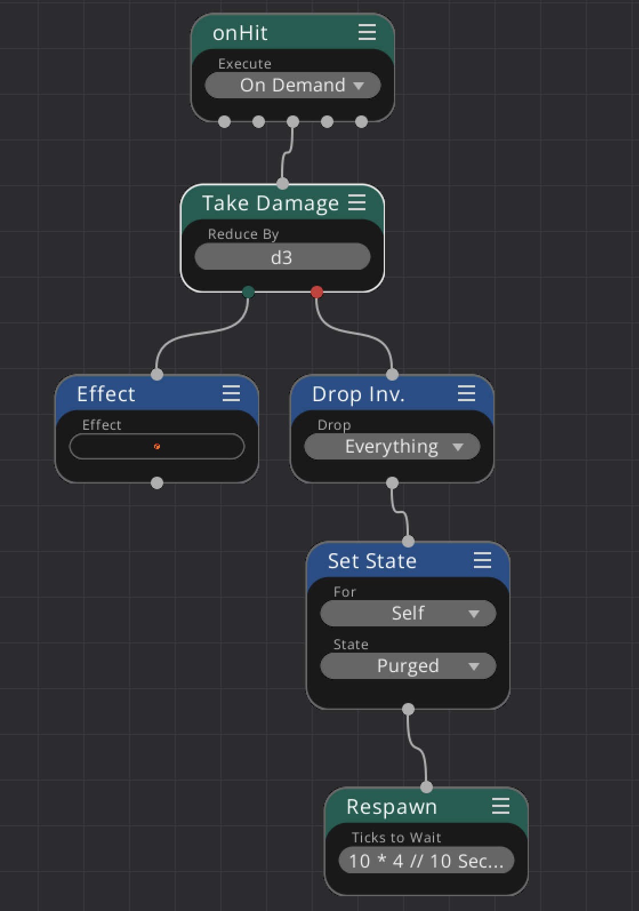

# Taking Damage: onHit

This example is for a monster which takes damage and respawns if killed. Note that the **onHit** tree is called by the attackers [Deal Damage](../../nodes/deal_damage.md) node.

First, we execute the [Take Damage](../../nodes/take_damage.md) node, here we reduce the damage by a dice throw of d3.

If we take the damage successfully we play an effect animation on the character using the [Effect](../../nodes/effect.md) node.

*If we do not take the damage successfully, we die*

In this case

* Drop all our inventory as loot for the attacker using the [Drop Inv.](../../nodes/drop_inventory.md) node.

* Set the state of the character to purged with the [Set State](../../nodes/set_state.md) node. This allows the system to re-allocate the memory used by this character.

* Respawn the monster after some time using the [Respawn](../../nodes/respawn.md) node. Note that this node has no further outgoing terminals, it is the end of the line for this character instance.

