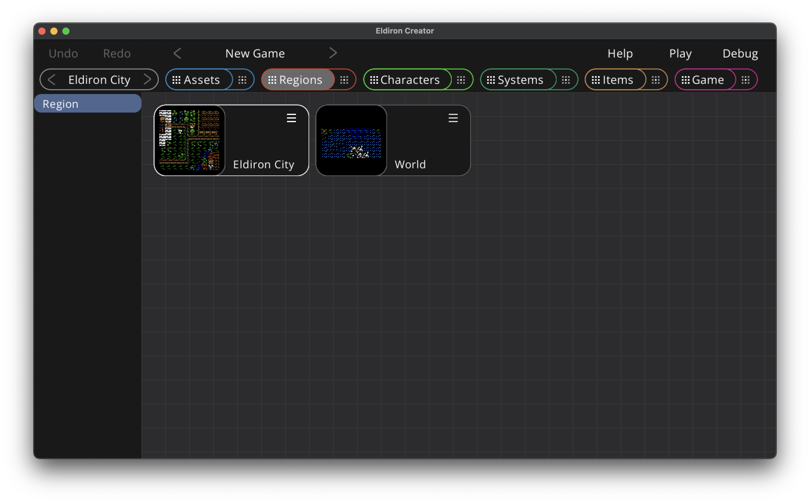

# Regions View: Overview

Regions in Eldiron can be towns, dungeons, the world itself, i.e. anywhere the characters can go. You can paint regions with the tiles you defined in the assets view. The behavior of tiles depends on the properties you set for the tiles in the [tile-map details view](./assets.md).

If you want to create a new region you can simply drag and drop the *Regions* item on the left into the overview. You can rename and delete regions using the context menu of each region node (located in the upper right of each node).

Opening the region details is as simple as clicking the preview thumbnail of the region node you want to edit.

# Region Details View

The details view has different modes which allow you to edit different aspects of a region:

- [Draw Tiles](./regions_drawing_tiles.md). The drawing mode. Hotkey: 'D'.
- [Edit Areas](./regions_edit_areas.md). Define areas and edit their behavior. Hotkey: 'E'.
- [Characters](./regions_characters.md). Place character instances in the region. Hotkey: 'C'.
- [Settings](./regions_settings.md). Edit the settings of the region. Hotkey: 'S'.

You can select the mode by clicking on the mode widget (which has a redish color) or by pressing the hotkey of a mode.
