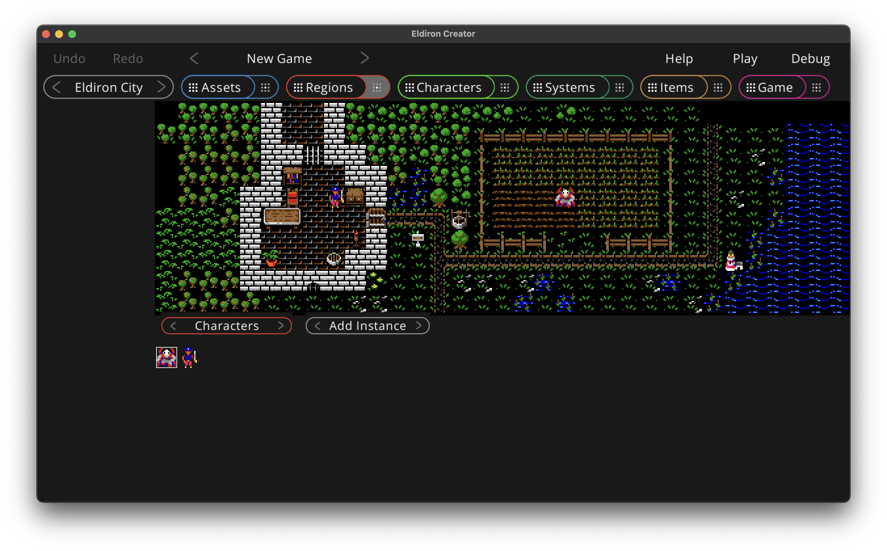

# Characters

When in the character mode, clicking on a tile in the region will create an instance of the currently selected character at the tile. You can select the characters in the character view below the region.

Characters are added if *Add Instance* is active, if *Remove* is active the clicked instance of a character is removed.

Missing features for v1.0:

* Name character instances.
* Optionally call a character script function on initialization (to set random character attributes or level).
* Define which character instance is the debug instance which is shown in the character view.