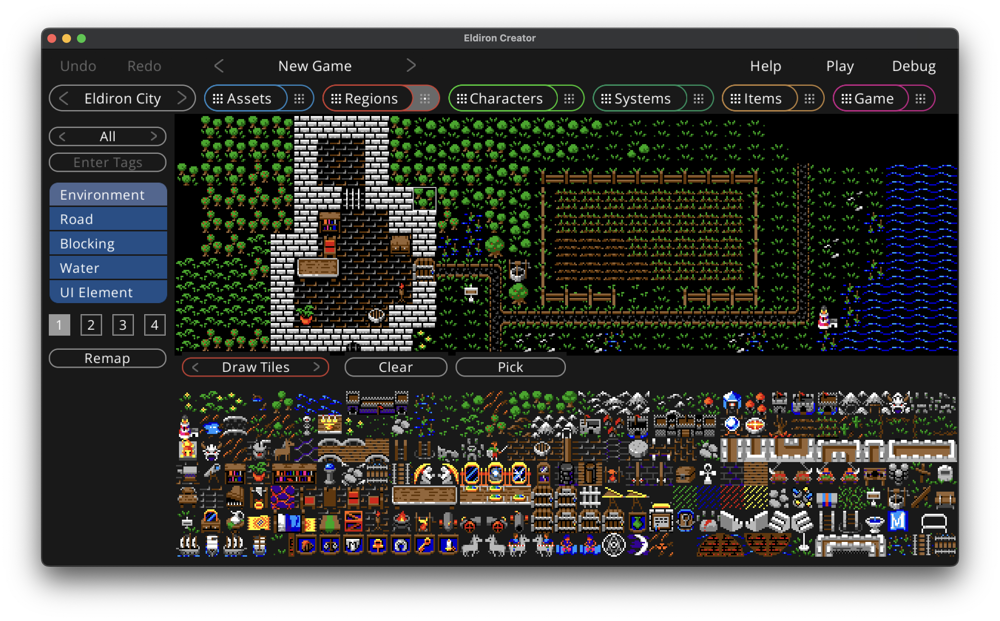

# Drawing Tiles

In the bottom of the view you have the tile selector. The tiles being shown depend on the currently selected valid usage role, which is one of *Environment*, *Road*, *Blocking*, *Water* and *UI Element*.

You can filter which tiles do show by:

- Cycling throw the tile-maps using the button at the top of the left sidebar (*All* shows the tiles of all tile-maps which is the default).
- Entering a tag, for example *door*, would only show tiles with a *door* tag.

While drawing you can select which layer to draw on, Eldiron supports 4 layers of transparency, with layer one having the lowest transparency level and four the highest.

The **Remap** buttons remaps all tiles in the region. This is necessary because the usage role of the tile is saved in the region itself. If you change the role of a tile in the [assets view](./assets.md), for example from an environment tile to a blocking tile, you need to remap the region to update the role of the tile.

While the the **Clear** button is checked Eldiron clears the clicked tile instead of drawing on it. The **Pick** button selects the tile at the currently clicked location so you can use it for drawing. The cleanr pick buttons of keyboard shortcuts of *C* and *P*.