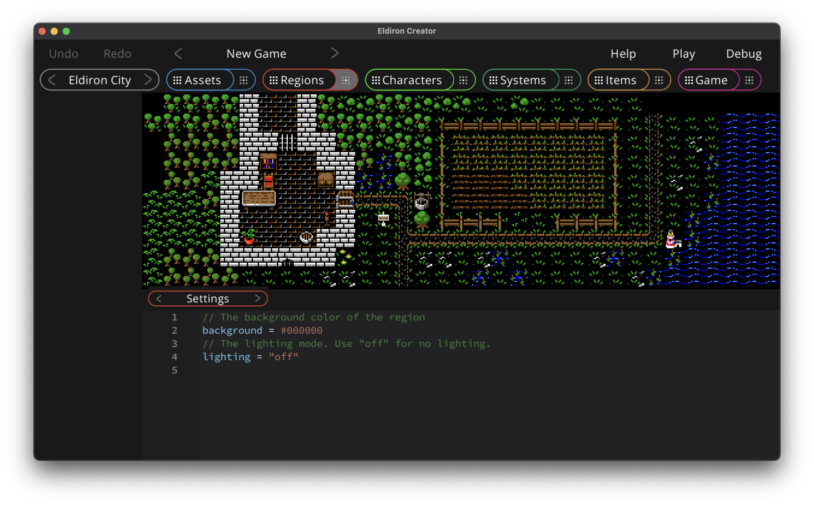

# Settings

In the settings you can tune many region specific settings.

* **background**. A hex color used as the background color of the region while drawing. Default is *#000000#, i.e. black.

Missing features:

* A lot